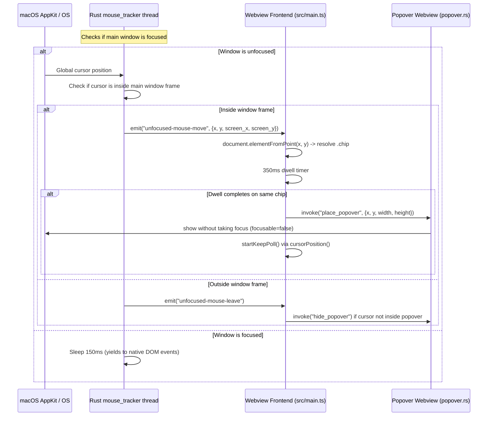

# JParser Phase 2L — Unfocused Window Hover Popovers (Design)

**Date:** 2026-08-16  
**Status:** Approved design, ready for implementation planning  
**Reference implementation:** `ta-old/` (Translation Aggregator, GPL v2)  
**Predecessor code:** the shipped Phase 2K tree at `21f50ff`  

## 1. Goal & Rationale

When Translation Aggregator is used as a companion reading overlay (e.g. pinned with *Always on top* or positioned beside/above another application), the user often has focus in their primary active application (such as a visual novel, game, web browser, or reader).

Currently, WebKit by default only delivers continuous mouse movement and hover events (`mouseover`, `mousemove`) when the webview's window is key/active. Moving the mouse over Japanese words in Translation Aggregator while another application has focus does not trigger the dictionary definition popovers unless the user clicks on Translation Aggregator to focus it first.

Phase 2L enables passive, unfocused hover detection so that:
- Moving the mouse cursor over Japanese word chips in Translation Aggregator triggers the standard 350ms dwell timer and displays the dictionary popover beneath the word.
- Neither hovering nor displaying the popover activates the application or steals focus from the user's active foreground application.
- The user can move the mouse from the word down into the popover window to read definitions or scroll through entries.
- Moving the cursor away from both the word and the popover dismisses the popover cleanly.

### In scope

- Add native background mouse tracking in Rust (`src-tauri/src/mouse_tracker.rs`) that tracks global cursor coordinates when the main window is inactive.
- Emit `unfocused-mouse-move` and `unfocused-mouse-leave` Tauri events to the webview.
- Add frontend event listeners in `src/main.ts` to resolve word chips via `document.elementFromPoint`, calculate `viewportOrigin`, manage the 350ms dwell timer, and trigger `openFor(chip)`.
- Coordinate with the existing non-activating popover window (`popover.rs`) and keep-rule loop (`startKeepPoll`) to preserve focus on the user's active game/application.
- Unit tests and live interaction verification.

### Out of scope / Non-goals

- Background hover visual states on header control buttons (*Always on top*, *Monitoring*, *Title bar*): buttons remain in their standard inactive visual state when unfocused.
- Stealing focus on hover: focus is strictly preserved on the user's active application unless the user explicitly clicks inside Translation Aggregator.

---

## 2. Architecture & Data Flow

---

## 3. Backend & Rust Plumbing

### 3.1 Background Mouse Tracker (`src-tauri/src/mouse_tracker.rs`)

A dedicated module running a lightweight background thread:
- Started once at application startup: `mouse_tracker::start(app.handle().clone())` in `src-tauri/src/main.rs`.
- **Loop Logic**:
  - Checks `win.is_focused()`.
  - When focused: sleeps 150ms and yields to standard webview mouse events.
  - When unfocused: sleeps 35ms, samples `[NSEvent mouseLocation]` and `[window frame]` on macOS (or OS equivalents).
- **Coordinate Conversion**:
  - `mouseLocation` has $(0,0)$ at display bottom-left in Cocoa logical points.
  - Checks if mouse is inside window:
    $$x \in [\text{win.origin.x}, \text{win.origin.x} + \text{win.width}] \quad\text{and}\quad y \in [\text{win.origin.y}, \text{win.origin.y} + \text{win.height}]$$
  - Converts to webview client coordinates:
    $$\text{clientX} = \text{mouse.x} - \text{win.origin.x}$$
    $$\text{clientY} = (\text{win.origin.y} + \text{win.height}) - \text{mouse.y}$$
    $$\text{screenX} = \text{mouse.x}$$
    $$\text{screenY} = \text{primaryScreenHeight} - \text{mouse.y}$$
- **Event Emission**:
  - Emits `"unfocused-mouse-move"` with `MouseMovePayload { x, y, screen_x, screen_y }` when cursor moves inside the window frame.
  - Emits `"unfocused-mouse-leave"` when cursor leaves the window frame.

### 3.2 Non-Activating Popover Window (`src-tauri/src/popover.rs`)

- The popover window is built with `.focusable(false)`, `.focused(false)`, `.always_on_top(true)`, and `.skip_taskbar(true)`.
- Invoking `place_popover` displays the tooltip window without stealing focus from the active foreground game or reader.

---

## 4. Frontend & UI (`src/main.ts`)

### 4.1 Unfocused Event Listeners

1. **`unfocused-mouse-move` Listener**:
   - Guarded by `if (document.hasFocus()) return;` so focused interaction relies 100% on native DOM events.
   - Finds element at cursor: `const el = document.elementFromPoint(e.payload.x, e.payload.y);`
   - Resolves chip: `const chip = chipFrom(el);`
   - If `chip` is found:
     - Updates `viewportOrigin = { x: e.payload.screen_x - e.payload.x, y: e.payload.screen_y - e.payload.y }`.
     - If cursor is on the same chip as previous tick: lets the ongoing 350ms dwell timer continue.
     - If cursor moved to a new chip: closes previous popover, clears previous dwell timer, and starts a fresh 350ms dwell timer (`openFor(chip)`).
   - If `chip === null` (e.g. over container padding/background):
     - Clears any pending dwell timer.
     - Closes open popover.

2. **`unfocused-mouse-leave` Listener**:
   - Guarded by `if (document.hasFocus()) return;`.
   - Clears pending dwell timer.
   - If `tooltipRect` is active, checks `cursorPosition()`: if the cursor is not inside `tooltipRect`, calls `closePopover()`.

### 4.2 Seamless Popover Keep Rule (`startKeepPoll`)

- When `openFor(chip)` opens the popover, `startKeepPoll` checks global coordinates via `cursorPosition()`.
- The user can move the cursor between the word chip and the popover window without dismissal.
- Once the cursor moves away from both the word and the popover window, `shouldKeep` returns `false` and hides the popover window.

---

## 5. Testing & Verification

1. **Rust Tests & Linting**:
   - `cargo test`: verify all existing 46 backend tests pass.
   - `cargo clippy --workspace --all-targets -- -D warnings`: verify 0 compiler/clippy warnings.
2. **Frontend Tests & Type Checking**:
   - `npm test`: all unit tests green.
   - `npx tsc --noEmit`: 0 type errors.
3. **Live Verification**:
   - **Unfocused Hover**: With another application active (e.g. Finder/game), hover over a Japanese word in Translation Aggregator: verify definition popover appears after 350ms dwell.
   - **Focus Integrity**: Verify the foreground application retains active focus throughout the hover and popover lifecycle.
   - **Popover Interaction**: Move mouse from word into popover window: verify popover stays open.
   - **Dismissal**: Move mouse away from word/popover: verify popover closes cleanly.
   - **Focused Mode**: Click into Translation Aggregator: verify standard focused hover continues working without regression.
