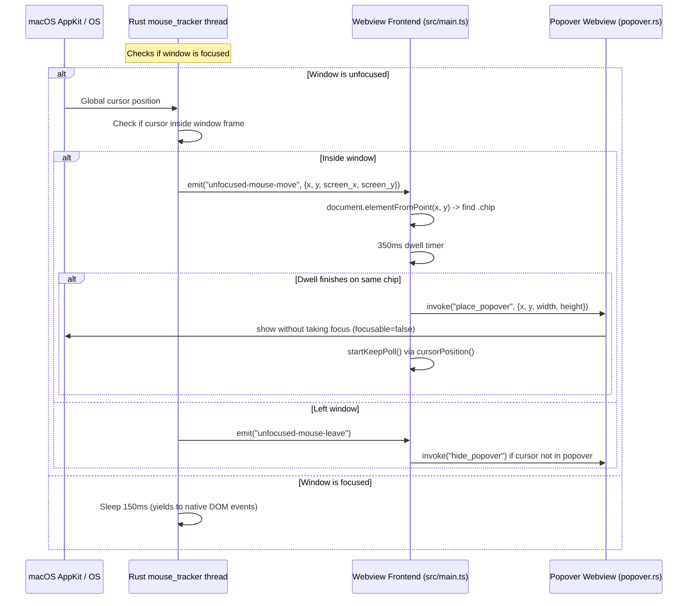

# Unfocused Window Hover Popover Design

## Goal

Enable dictionary definition popovers to open when hovering over Japanese word chips in Translation Aggregator even when the application window is running in the background (unfocused), without stealing focus from the active foreground game, reader, or application.

## Requirements

1. **Passive Background Hover**: When Translation Aggregator is inactive / unfocused, moving the cursor over a Japanese word chip in the main window triggers the standard 350ms dwell timer and displays the dictionary definition popover beneath the word.
2. **Focus Preservation**: Neither hovering over a word nor displaying the popover window may activate the app or steal focus from the user's active foreground application.
3. **Word Chips Only**: Background mouse tracking is scoped to Japanese word chips (`.chip`). Header control buttons (*Always on top*, *Monitoring*, *Title bar*) remain in their standard inactive visual state when unfocused and do not show hover states.
4. **Seamless Popover Keep Rule**: When the popover opens from an unfocused hover, the user can move the mouse from the word down into the popover window to read definitions or scroll. Once the cursor moves away from both the word and the popover window, the popover dismisses automatically.
5. **Focused Behavior Preserved**: When the main window is focused, native DOM `mouseover` / `mouseout` handling operates normally without interference.

---

## Architecture & Data Flow

---

## Technical Details

### 1. Rust Background Mouse Tracker (`src-tauri/src/mouse_tracker.rs`)

- **Thread Loop**:
  - Checks `main_window.is_focused()`.
  - When focused: sleeps 150ms and yields to DOM events.
  - When unfocused: sleeps 35ms, samples `[NSEvent mouseLocation]` and `[window frame]` on macOS (or OS equivalents).
- **Coordinate Conversion**:
  - `mouseLocation` is measured from display bottom-left in Cocoa logical points.
  - Checks containment: $x \in [\text{origin.x}, \text{origin.x} + \text{width}]$ and $y \in [\text{origin.y}, \text{origin.y} + \text{height}]$.
  - Converts to webview client coordinates:
    - $\text{clientX} = \text{mouse.x} - \text{origin.x}$
    - $\text{clientY} = (\text{origin.y} + \text{height}) - \text{mouse.y}$
    - $\text{screenX} = \text{mouse.x}$
    - $\text{screenY} = \text{primaryScreenHeight} - \text{mouse.y}$
- **Events**:
  - `unfocused-mouse-move`: Payload contains `x`, `y`, `screen_x`, `screen_y`. Emitted only when coordinates change by $> 0.1\text{px}$.
  - `unfocused-mouse-leave`: Emitted once when cursor transitions from inside to outside the window frame.

### 2. Frontend Event Handlers (`src/main.ts`)

- **`unfocused-mouse-move` Listener**:
  - If `document.hasFocus()` is true: ignore event.
  - Uses `document.elementFromPoint(e.payload.x, e.payload.y)` to resolve target.
  - Checks `chip = chipFrom(target)`:
    - If `chip` found:
      - Updates `viewportOrigin = { x: e.payload.screen_x - e.payload.x, y: e.payload.screen_y - e.payload.y }`.
      - If moving within the same chip: do nothing (dwell continues).
      - If new chip: closes any open popover, clears previous dwell, and sets 350ms dwell timer (`openFor(chip)`).
    - If `chip === null`:
      - Clears pending dwell timer.
      - Closes open popover.
- **`unfocused-mouse-leave` Listener**:
  - If `document.hasFocus()` is true: ignore event.
  - Clears pending dwell timer.
  - If a popover is active, reads `cursorPosition()`: if cursor is outside `tooltipRect`, calls `closePopover()`.

### 3. Non-Activating Popover Window (`src-tauri/src/popover.rs`)

- Popover window is built with `.focusable(false)`, `.focused(false)`, `.always_on_top(true)`.
- Showing and positioning via `place_popover` renders the tooltip on top of all windows without stealing keyboard or window focus from the user's primary application.

---

## Verification & Testing

1. **Rust Tests & Linting**:
   - `cargo test`: verify all test suites pass.
   - `cargo clippy --workspace --all-targets -- -D warnings`: 0 warnings.
2. **Frontend Tests & Type Checking**:
   - `npm test`: all unit tests green.
   - `npx tsc --noEmit`: 0 type errors.
3. **Live Verification**:
   - Background hover over a word: popover appears after 350ms dwell.
   - Active foreground app retains focus continuously.
   - Moving from word to popover preserves popover.
   - Moving to non-chip or off-window dismisses popover.
   - Focusing Translation Aggregator returns to native DOM hover.
